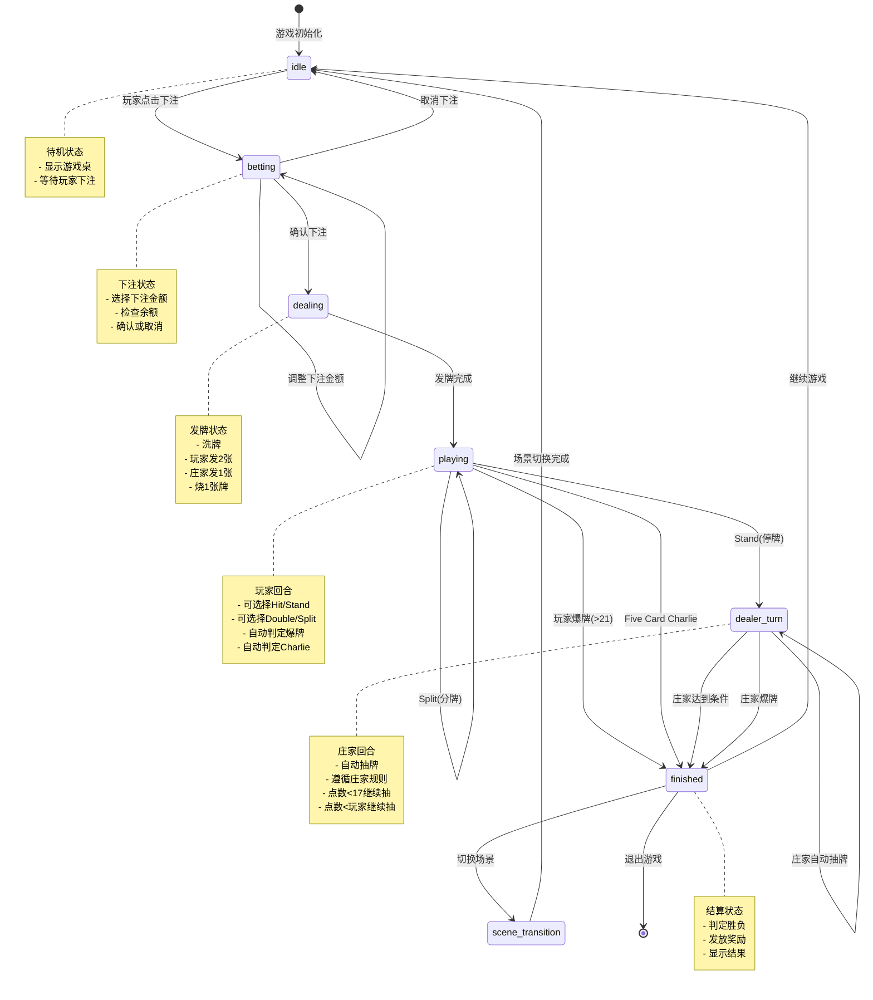

# 游戏状态机设计

## 状态机图（Mermaid）



## 状态详细说明

### 1. idle（待机状态）

**进入条件**：
- 游戏初始化
- 上一局结束后选择继续
- 取消下注

**状态特征**：
- 游戏桌显示空手牌
- 下注按钮可用
- 其他按钮禁用

**可执行操作**：
- 点击下注按钮 → 进入 betting
- 切换场景 → 进入 scene_transition
- 退出游戏 → 结束

**UI显示**：
```typescript
{
  status: 'idle',
  playerHand: [],
  dealerHand: [],
  currentBet: 0,
  availableActions: ['bet', 'changeScene', 'exit']
}
```

---

### 2. betting（下注状态）

**进入条件**：
- 从 idle 点击下注按钮

**状态特征**：
- 显示下注面板
- 可调整下注金额
- 显示当前余额

**可执行操作**：
- 增加/减少下注金额
- 确认下注 → 进入 dealing
- 取消下注 → 返回 idle

**验证规则**：
```typescript
// 下注金额验证
const canBet = (amount: number, player: Player, scene: Scene) => {
  return amount >= scene.minBet
    && amount <= scene.maxBet
    && amount <= player.money;
};
```

**UI显示**：
```typescript
{
  status: 'betting',
  currentBet: 100,
  minBet: 10,
  maxBet: 1000,
  playerMoney: 5000,
  availableActions: ['increaseBet', 'decreaseBet', 'confirm', 'cancel']
}
```

---

### 3. dealing（发牌状态）

**进入条件**：
- 从 betting 确认下注

**状态特征**：
- 自动执行，无需玩家操作
- 播放发牌动画
- 短暂状态（约2秒）

**执行流程**：
```typescript
async function dealCards() {
  // 1. 检查牌堆，少于5张重新洗牌
  if (deck.length < 5) {
    deck = shuffleDeck(initDeck());
  }

  // 2. 玩家发2张牌（带动画延迟）
  playerHand.push(drawCard()); // 延迟0.3s
  playerHand.push(drawCard()); // 延迟0.3s

  // 3. 烧1张牌（防作弊）
  drawCard();

  // 4. 庄家发1张牌
  dealerHand.push(drawCard()); // 延迟0.3s

  // 5. 转换到 playing 状态
  status = 'playing';
}
```

**自动转换**：
- 发牌完成 → 自动进入 playing

---

### 4. playing（玩家回合）

**进入条件**：
- 从 dealing 发牌完成

**状态特征**：
- 玩家可以操作
- 显示当前点数
- 显示可用操作按钮

**可执行操作**：

#### Hit（要牌）
```typescript
function hit() {
  // 1. 抽一张牌
  const card = drawCard();
  playerHand.push(card);

  // 2. 计算分数
  const score = calculateScore(playerHand);

  // 3. 判定结果
  if (score > 21) {
    status = 'finished';
    result = 'lose';
  } else if (playerHand.length === 5 && score < 21) {
    status = 'finished';
    result = 'charlie';
  }
  // 否则继续 playing
}
```

#### Stand（停牌）
```typescript
function stand() {
  // 直接进入庄家回合
  status = 'dealer_turn';
}
```

#### Double Down（加倍）
```typescript
function doubleDown() {
  // 1. 检查条件
  if (playerHand.length !== 2) return;
  if (player.money < currentBet) return;

  // 2. 加倍下注
  currentBet *= 2;
  player.money -= currentBet / 2;

  // 3. 只能再抽1张
  hit();

  // 4. 自动Stand
  if (status === 'playing') {
    stand();
  }
}
```

#### Split（分牌）
```typescript
function split() {
  // 1. 检查条件
  if (playerHand.length !== 2) return;
  if (playerHand[0].value !== playerHand[1].value) return;
  if (player.money < currentBet) return;

  // 2. 分成两手（简化实现：只处理第一手）
  // 完整实现需要支持多手牌
  const hand2 = [playerHand.pop()];

  // 3. 每手补一张牌
  playerHand.push(drawCard());
  hand2.push(drawCard());

  // 继续playing状态
}
```

**UI显示**：
```typescript
{
  status: 'playing',
  playerHand: [card1, card2],
  dealerHand: [card1],
  playerScore: 19,
  dealerScore: 10,
  availableActions: ['hit', 'stand', 'double', 'split']
}
```

---

### 5. dealer_turn（庄家回合）

**进入条件**：
- 从 playing 执行 Stand

**状态特征**：
- 自动执行，无需玩家操作
- 庄家按规则自动抽牌
- 播放抽牌动画

**执行流程**：
```typescript
async function dealerTurn() {
  const playerScore = calculateScore(playerHand);

  while (dealerShouldHit(dealerHand, playerScore)) {
    // 延迟0.5s播放动画
    await delay(500);

    const card = drawCard();
    dealerHand.push(card);

    const dealerScore = calculateScore(dealerHand);

    // 检查爆牌
    if (dealerScore > 21) break;

    // 检查Five Card Charlie
    if (dealerHand.length === 5 && dealerScore < 21) break;
  }

  // 转换到finished状态
  status = 'finished';
  result = determineResult(playerHand, dealerHand);
}
```

**庄家规则**：
```typescript
function dealerShouldHit(dealerHand: PlayingCard[], playerScore: number): boolean {
  const dealerScore = calculateScore(dealerHand);

  // 基础规则：小于17必须抽
  if (dealerScore < 17) return true;

  // 小于玩家分数继续抽
  if (dealerScore < playerScore && dealerScore < 21) return true;

  return false;
}
```

**自动转换**：
- 庄家达到条件 → 自动进入 finished

---

### 6. finished（结算状态）

**进入条件**：
- 从 playing：玩家爆牌或Five Card Charlie
- 从 dealer_turn：庄家完成抽牌

**状态特征**：
- 显示游戏结果
- 显示奖励
- 等待玩家操作

**结果判定**：
```typescript
function determineResult(
  playerHand: PlayingCard[],
  dealerHand: PlayingCard[]
): GameResult {
  const playerScore = calculateScore(playerHand);
  const dealerScore = calculateScore(dealerHand);

  // 玩家爆牌
  if (playerScore > 21) return 'lose';

  // Five Card Charlie
  if (isFiveCardCharlie(playerHand)) return 'charlie';

  // Blackjack
  if (isBlackjack(playerHand) && !isBlackjack(dealerHand)) {
    return 'blackjack';
  }

  // 庄家爆牌
  if (dealerScore > 21) return 'win';

  // 比较点数
  if (playerScore > dealerScore) return 'win';
  if (playerScore < dealerScore) return 'lose';
  return 'push';
}
```

**奖励发放**：
```typescript
function giveReward(result: GameResult, bet: number, sceneId: string) {
  const reward = calculateReward(result, bet, sceneId);

  // 发放星币
  player.money += reward.money;

  // 发放资源卡
  reward.cards.forEach(card => {
    addCardToInventory(player.inventory, card, 1);
  });

  // 显示奖励弹窗
  showRewardModal(reward);
}
```

**可执行操作**：
- 继续游戏 → 返回 idle
- 切换场景 → 进入 scene_transition
- 退出游戏 → 结束

**UI显示**：
```typescript
{
  status: 'finished',
  result: 'win',
  playerScore: 20,
  dealerScore: 18,
  reward: {
    money: 200,
    cards: [ironOre]
  },
  availableActions: ['continue', 'changeScene', 'exit']
}
```

---

### 7. scene_transition（场景切换）

**进入条件**：
- 从 idle 或 finished 选择切换场景

**状态特征**：
- 短暂过渡状态
- 播放场景切换动画
- 加载新场景资源

**执行流程**：
```typescript
async function changeScene(newSceneId: string) {
  // 1. 检查解锁条件
  const scene = getScene(newSceneId);
  if (!canUnlockScene(scene, player)) {
    showError('场景未解锁');
    return;
  }

  // 2. 播放淡出动画
  await fadeOut();

  // 3. 加载新场景
  currentScene = newSceneId;
  loadSceneAssets(newSceneId);

  // 4. 播放淡入动画
  await fadeIn();

  // 5. 返回idle状态
  status = 'idle';
}
```

**自动转换**：
- 场景切换完成 → 自动进入 idle

---

## 状态转换触发事件

| 当前状态 | 事件 | 目标状态 | 条件 |
|----------|------|----------|------|
| idle | CLICK_BET | betting | 无 |
| idle | CHANGE_SCENE | scene_transition | 场景已解锁 |
| betting | CONFIRM_BET | dealing | 下注有效 |
| betting | CANCEL_BET | idle | 无 |
| dealing | DEAL_COMPLETE | playing | 自动 |
| playing | CLICK_HIT | playing/finished | 根据结果 |
| playing | CLICK_STAND | dealer_turn | 无 |
| playing | CLICK_DOUBLE | playing/dealer_turn | 条件满足 |
| playing | CLICK_SPLIT | playing | 条件满足 |
| playing | AUTO_BUST | finished | 点数>21 |
| playing | AUTO_CHARLIE | finished | 5张牌<21 |
| dealer_turn | DEALER_COMPLETE | finished | 自动 |
| finished | CLICK_CONTINUE | idle | 无 |
| finished | CHANGE_SCENE | scene_transition | 场景已解锁 |
| scene_transition | SCENE_LOADED | idle | 自动 |

---

## 状态持久化

需要保存的状态数据：
```typescript
interface SavedGameState {
  // 游戏状态
  status: GameState['status'];
  currentBet: number;

  // 手牌
  playerHand: PlayingCard[];
  dealerHand: PlayingCard[];

  // 牌堆（用于恢复游戏）
  deck: PlayingCard[];

  // 玩家数据
  player: Player;
  inventory: Inventory;

  // 场景进度
  currentScene: string;
  unlockedScenes: string[];
}
```

---

**文档版本**：v1.0
**创建日期**：2026-03-14