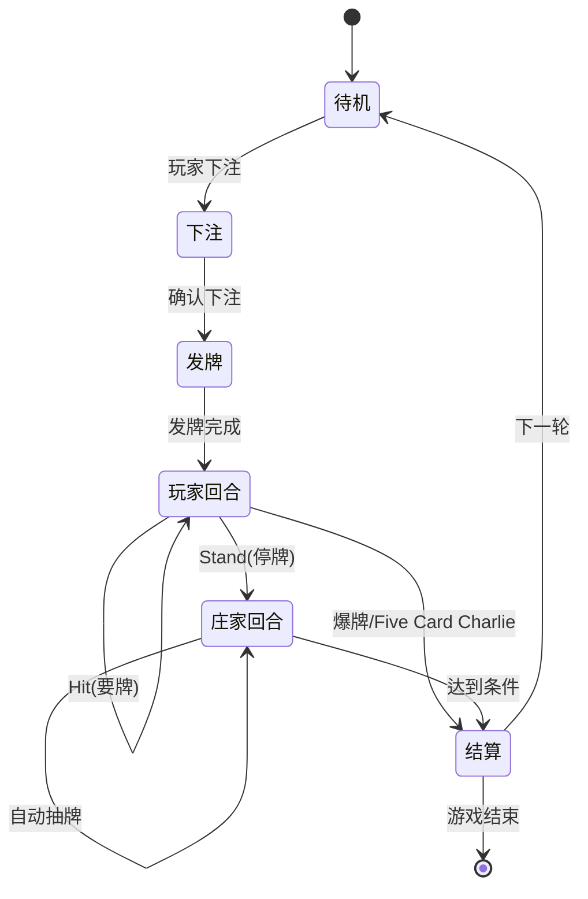

# 太空21点游戏规则文档

> Space 21 - 太空矿工的赌局 完整游戏规则

---

## 📋 一、21点核心规则

### 1.1 基础流程



#### 流程详解

| 阶段 | 操作 | 说明 |
|------|------|------|
| **1. 下注** | 玩家选择下注金额 | 范围：10-1000星币（根据场景不同） |
| **2. 发牌** | 系统自动发牌 | 玩家2张明牌，庄家1张明牌 |
| **3. 玩家回合** | 玩家选择Hit或Stand | 可多次Hit直到爆牌或停牌 |
| **4. 庄家回合** | 庄家自动抽牌 | 按固定规则抽牌 |
| **5. 结算** | 判定胜负，发放奖励 | 星币 + 资源卡 |

### 1.2 牌面点数规则

| 牌面 | 点数 | 说明 |
|------|------|------|
| A（Ace） | 11 或 1 | 自动选择最优值 |
| 2-10 | 面值 | 按数字计算 |
| J/Q/K | 10 | 人头牌统一为10点 |

### 1.3 Ace自动转换逻辑

**转换规则**：
- Ace初始值为11点
- 当总点数 > 21时，自动将Ace转换为1点（-10）
- 如果有多个Ace，逐个转换直到不爆牌或所有Ace都转换完

**示例**：
```
手牌：A + A + 9
初始：11 + 11 + 9 = 31（爆牌）
转换1：1 + 11 + 9 = 21（第一个A转为1）
结果：21点
```

```
手牌：A + A + A + 8
初始：11 + 11 + 11 + 8 = 41（爆牌）
转换1：1 + 11 + 11 + 8 = 31（仍爆牌）
转换2：1 + 1 + 11 + 8 = 21（两个A转为1）
结果：21点
```

### 1.4 特殊规则

#### Blackjack（天然21点）

**定义**：前两张牌为 A + 10点牌（10/J/Q/K）

**特点**：
- 赔率：2.5倍（原注的2.5倍）
- 优先级：高于普通21点
- 即时结算：无需等待庄家

**示例**：
```
下注：100星币
手牌：A♠ + K♥
结果：Blackjack
奖励：250星币 + 2张稀有资源卡
```

#### Double Down（加倍下注）

**条件**：前两张牌后可选择

**规则**：
- 下注金额翻倍
- 只能再抽1张牌
- 自动Stand

**示例**：
```
初始下注：100星币
手牌：5♣ + 6♦（总11点）
选择Double Down：追加100星币
抽到：9♠
最终：20点，总下注200星币
```

#### Split（分牌）

**条件**：前两张牌点数相同

**规则**：
- 分成两手独立游戏
- 每手需要额外下注（等于原注）
- 分别进行Hit/Stand
- 分牌后的A只能再抽1张

**示例**：
```
初始下注：100星币
手牌：8♠ + 8♥
选择Split：追加100星币
手牌1：8♠ + ?
手牌2：8♥ + ?
总下注：200星币
```

#### Five Card Charlie（五张牌不爆）

**定义**：持有5张牌且总点数 < 21

**特点**：
- 自动获胜
- 赔率：3倍
- 优先级：高于普通胜利

**示例**：
```
手牌：2 + 3 + 4 + 5 + 6 = 20点（5张牌）
结果：Five Card Charlie
奖励：3倍下注 + 2张稀有资源卡
```

### 1.5 庄家规则

**自动抽牌条件**：
1. 点数 < 17：必须抽牌
2. 点数 < 玩家点数 且 < 21：继续抽牌
3. 点数 ≥ 17 且 ≥ 玩家点数：停牌
4. 点数 > 21：爆牌

**特殊规则**（根据场景不同）：
- 新手矿区：标准规则
- 中级矿区：17点必须停牌（Soft 17也停）
- 深空矿区：可以看到玩家第一张牌
- 危险区：庄家可以看到玩家第一张牌

### 1.6 胜负判定

| 条件 | 结果 | 赔率 | 资源卡奖励 |
|------|------|------|------------|
| 玩家Blackjack | 大赢 | 2.5倍 | 2张稀有卡 |
| 玩家Five Card Charlie | 大赢 | 3倍 | 2张稀有卡 |
| 玩家爆牌（>21） | 输 | 0 | 无 |
| 庄家爆牌 | 赢 | 2倍 | 1张资源卡 |
| 玩家点数 > 庄家 | 赢 | 2倍 | 1张资源卡 |
| 玩家点数 < 庄家 | 输 | 0 | 无 |
| 点数相同 | 平局 | 1倍（退还） | 无 |

---

## 🎴 二、资源卡系统

### 2.1 卡牌类型

#### 矿石卡（Ore）

| 卡牌名称 | 重量 | 价格 | 稀有度 | 用途 |
|----------|------|------|--------|------|
| 铁矿 Iron Ore | 5kg | 50星币 | 普通 | 出售换钱、升级装备 |
| 金矿 Gold Ore | 8kg | 200星币 | 稀有 | 出售换钱、高级装备 |
| 银矿 Silver Ore | 6kg | 120星币 | 稀有 | 出售换钱、装备材料 |
| 钻石 Diamond | 2kg | 1000星币 | 史诗 | 解锁区域、顶级装备 |

#### 食物卡（Food）

| 卡牌名称 | 重量 | 价格 | HP恢复 | 稀有度 |
|----------|------|------|--------|--------|
| 能量棒 Energy Bar | 1kg | 30星币 | +20 HP | 普通 |
| 太空餐 Space Meal | 2kg | 80星币 | +50 HP | 普通 |
| 高级营养液 Premium Nutrient | 1kg | 200星币 | +100 HP | 稀有 |

#### 装备卡（Equipment）

| 卡牌名称 | 重量 | 价格 | 效果 | 稀有度 |
|----------|------|------|------|--------|
| 采矿工具 Mining Tool | 10kg | 500星币 | 提升资源获取率 | 稀有 |
| 防护服 Armor | 15kg | 800星币 | 增加最大HP | 稀有 |
| 扫描仪 Scanner | 5kg | 1200星币 | 显示隐藏信息 | 史诗 |

#### 特殊卡（Special）

| 卡牌名称 | 重量 | 价格 | 效果 | 稀有度 |
|----------|------|------|------|--------|
| 通行证 Pass | 0kg | - | 解锁新区域 | 史诗 |
| 钥匙 Key | 0kg | - | 打开特殊箱子 | 史诗 |
| 幸运币 Lucky Coin | 0kg | - | 提升奖励概率 | 传说 |

### 2.2 堆叠规则

**自动堆叠**：
- 同名卡牌自动合并为一个堆叠
- 显示数量标记（如 "x10"）
- 最大堆叠数：999（大部分卡牌）

**堆叠限制**：
```typescript
interface CardStack {
  card: ResourceCard;
  count: number;        // 当前数量
  maxStack: number;     // 最大堆叠数（来自卡牌定义）
}
```

**分离规则**：
- 点击堆叠卡牌时，分离1张
- 原位置保留剩余数量
- 新卡牌进入拖拽状态

### 2.3 负重系统

**负重计算**：
```
总重量 = Σ(卡牌重量 × 数量)
```

**示例**：
```
手牌卡组：
- 铁矿 x5：5kg × 5 = 25kg
- 金矿 x2：8kg × 2 = 16kg
- 能量棒 x3：1kg × 3 = 3kg
总重量：44kg / 100kg
```

**超重处理**：
- 无法添加新卡牌
- 界面显示红色警告
- 负重条闪烁提示

**卡组类型**：

| 卡组 | 最大负重 | 用途 |
|------|----------|------|
| 手牌卡组 | 100kg | 随身携带，快速访问 |
| 仓库卡组 | 500kg | 长期存储 |

### 2.4 奖励机制

**奖励来源**：
1. 赢得21点赌局
2. 完成NPC任务
3. 商店购买
4. 场景探索

**奖励规则**：

| 游戏结果 | 星币倍率 | 资源卡数量 | 稀有度池 |
|----------|----------|------------|----------|
| Blackjack | 2.5倍 | 2张 | 稀有+史诗 |
| Five Card Charlie | 3倍 | 2张 | 稀有+史诗 |
| 普通胜利 | 2倍 | 1张 | 普通+稀有 |
| 平局 | 1倍 | 0张 | - |
| 失败 | 0倍 | 0张 | - |

**场景影响**：
- 新手矿区：普通卡为主
- 中级矿区：稀有卡概率提升
- 深空矿区：史诗卡概率提升
- 危险区：传说卡有概率掉落

---

## 🌌 三、场景系统

### 3.1 场景列表

#### 新手矿区（Tutorial Zone）

**基本信息**：
- 场景ID：`tutorial_zone`
- 解锁条件：无（初始场景）
- NPC庄家：机器人教官

**赌局设置**：
- 最低下注：10星币
- 最高下注：100星币
- 特殊规则：无
- 庄家策略：标准规则

**奖励卡池**：
- 铁矿（60%）
- 石头（30%）
- 冰（10%）

**连接场景**：
- → 中级矿区（需要500星币）

#### 中级矿区（Mid-Level Zone）

**基本信息**：
- 场景ID：`mid_zone`
- 解锁条件：拥有500星币
- NPC庄家：老矿工杰克

**赌局设置**：
- 最低下注：50星币
- 最高下注：500星币
- 特殊规则：庄家17点必须停牌
- 庄家策略：保守型

**奖励卡池**：
- 铁矿（30%）
- 金矿（25%）
- 银矿（25%）
- 能量棒（20%）

**连接场景**：
- ← 新手矿区
- → 深空矿区（需要通行证）

#### 深空矿区（Deep Space Zone）

**基本信息**：
- 场景ID：`deep_space`
- 解锁条件：拥有深空通行证
- NPC庄家：神秘商人

**赌局设置**：
- 最低下注：200星币
- 最高下注：2000星币
- 特殊规则：允许Split和Double Down
- 庄家策略：激进型

**奖励卡池**：
- 金矿（30%）
- 钻石（15%）
- 稀有装备（30%）
- 通行证（5%）
- 其他（20%）

**连接场景**：
- ← 中级矿区
- → 危险区（需要特殊钥匙）

#### 危险区（Danger Zone）

**基本信息**：
- 场景ID：`danger_zone`
- 解锁条件：拥有危险区钥匙
- NPC庄家：海盗头目

**赌局设置**：
- 最低下注：500星币
- 最高下注：10000星币
- 特殊规则：庄家可以看到玩家第一张牌
- 庄家策略：作弊型（高难度）

**奖励卡池**：
- 钻石（40%）
- 史诗装备（30%）
- 传说装备（5%）
- 大量星币（25%）

**连接场景**：
- ← 深空矿区

### 3.2 场景切换

**切换方式**：
1. 点击场景卡片
2. 选择连接的场景
3. 检查解锁条件
4. 确认切换

**切换限制**：
- 赌局进行中无法切换
- 必须满足解锁条件
- 某些场景需要特殊道具

### 3.3 NPC交互规则

**交互方式**：
- 点击NPC卡片触发对话
- 对话支持分支选择
- 可触发任务或交易

**NPC类型**：

| NPC | 功能 | 位置 |
|-----|------|------|
| 机器人教官 | 教学、简单赌局 | 新手矿区 |
| 老矿工杰克 | 赌局、商店 | 中级矿区 |
| 神秘商人 | 高级赌局、稀有物品 | 深空矿区 |
| 海盗头目 | 高风险赌局 | 危险区 |

### 3.4 商店系统

**商店功能**：
1. 购买资源卡
2. 出售资源卡
3. 购买装备
4. 兑换特殊道具

**价格机制**：
- 购买价格：卡牌定义价格
- 出售价格：购买价格的50%
- 特殊道具：固定价格

**商店库存**：
- 每个场景的商店库存不同
- 每次访问随机刷新部分商品
- 稀有物品限量供应

**示例商店**：
```
老矿工杰克的商店：
- 能量棒 x10：30星币/个
- 采矿工具 x1：500星币
- 金矿 x5：200星币/个
- 深空通行证 x1：2000星币
```

---

## 🎯 四、游戏进度系统

### 4.1 玩家属性

```typescript
interface Player {
  name: string;           // 玩家名称
  money: number;          // 星币数量
  hp: number;             // 当前HP
  maxHp: number;          // 最大HP
  level: number;          // 等级
  exp: number;            // 经验值
  currentScene: string;   // 当前场景ID
}
```

### 4.2 经验值系统

**获取经验**：
- 赢得赌局：+10 EXP
- Blackjack：+20 EXP
- Five Card Charlie：+30 EXP
- 完成任务：+50 EXP

**升级奖励**：
- 最大HP +20
- 背包负重 +20kg
- 解锁新技能

### 4.3 存档系统

**自动存档**：
- 每次赌局结束
- 场景切换时
- 购买/出售物品后

**手动存档**：
- 暂停菜单中选择保存
- 最多3个存档槽位

**存档内容**：
- 玩家属性
- 背包内容
- 当前场景
- 游戏进度
- 解锁状态

---

## 📊 五、游戏平衡性

### 5.1 难度曲线

| 场景 | 难度 | 建议等级 | 建议资金 |
|------|------|----------|----------|
| 新手矿区 | ⭐ | 1-3 | 100-500 |
| 中级矿区 | ⭐⭐ | 3-5 | 500-2000 |
| 深空矿区 | ⭐⭐⭐ | 5-8 | 2000-10000 |
| 危险区 | ⭐⭐⭐⭐⭐ | 8+ | 10000+ |

### 5.2 经济平衡

**收入来源**：
- 赢得赌局（主要）
- 出售资源卡
- 完成任务

**支出项目**：
- 赌局下注
- 购买物品
- 恢复HP（食物）

**建议策略**：
- 新手期：小额下注，积累资金
- 中期：适度冒险，收集装备
- 后期：高风险高回报

---

## 🎮 六、特殊机制

### 6.1 连胜奖励

**连胜计数**：
- 连续赢得赌局
- 失败或平局重置

**奖励加成**：
- 3连胜：资源卡稀有度+1
- 5连胜：星币奖励+50%
- 10连胜：获得传说卡牌

### 6.2 每日任务

**任务示例**：
- 赢得3局赌局
- 收集10个铁矿
- 访问所有场景
- 达到21点（不是Blackjack）

**任务奖励**：
- 星币
- 经验值
- 特殊道具

### 6.3 成就系统

**成就类别**：
- 赌局成就（赢得100局等）
- 收集成就（收集所有卡牌）
- 探索成就（访问所有场景）
- 特殊成就（连续10次Blackjack）

---

**文档版本**：v1.0
**创建日期**：2026-03-14
**游戏版本**：Space 21 v1.0