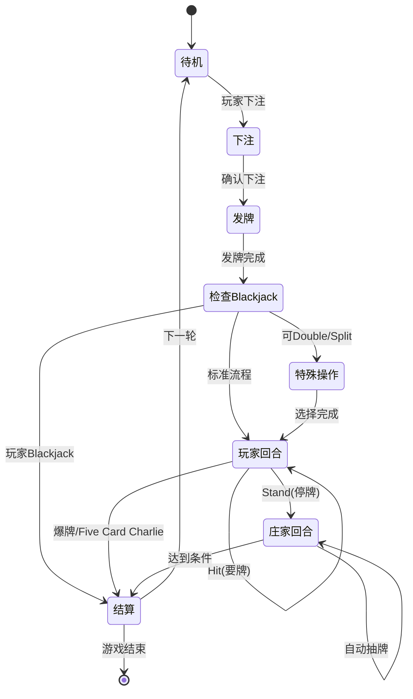

# 太空21点游戏规则文档

> Space 21 - 太空矿工的赌局 完整游戏规则

---

## 📋 一、21点核心规则

### 1.1 基础流程



#### 详细交互流程

**阶段1：待机状态（IDLE）**

UI状态：
- ✅ 显示"开始游戏"按钮
- ✅ 显示当前星币余额
- ✅ 显示场景信息和NPC
- ❌ 禁用所有游戏操作按钮

玩家操作：
- 点击"开始游戏" → 进入下注阶段
- 查看背包、商店、场景切换

---

**阶段2：下注阶段（BETTING）**

UI状态：
- ✅ 显示下注滑块/输入框
- ✅ 显示最小/最大下注限制
- ✅ 显示"确认下注"和"取消"按钮
- ✅ 实时显示剩余星币

玩家操作：
1. 调整下注金额（最小值 ≤ 金额 ≤ min(最大值, 当前星币)）
2. 点击"确认下注" → 扣除星币，进入发牌阶段
3. 点击"取消" → 返回待机状态

错误处理：
- 星币不足：禁用"确认下注"按钮，显示提示
- 下注金额 < 最小值：按钮禁用
- 下注金额 > 最大值：自动限制为最大值

---

**阶段3：发牌阶段（DEALING）**

动画流程：
1. 发玩家第1张牌（翻牌动画，0.3s）
2. 发庄家第1张牌（翻牌动画，0.3s）
3. 发玩家第2张牌（翻牌动画，0.3s）
4. 发牌完成，进入检查阶段

UI状态：
- ✅ 显示牌面动画
- ✅ 显示当前点数（实时计算Ace）
- ❌ 禁用所有操作按钮（动画期间）

---

**阶段4：Blackjack检查（CHECK_BLACKJACK）**

检查逻辑：
```
IF 玩家前两张牌 = A + 10点牌 THEN
  → 即时结算（2.5倍奖励）
  → 跳过玩家回合和庄家回合
ELSE IF 可以Double Down 或 Split THEN
  → 显示特殊操作选项
ELSE
  → 进入标准玩家回合
END IF
```

---

**阶段5：特殊操作选择（SPECIAL_OPTIONS）**

触发条件：
- **Double Down**：前两张牌，且星币 ≥ 当前下注额
- **Split**：前两张牌点数相同，且星币 ≥ 当前下注额

UI状态：
- ✅ 显示"Double Down"按钮（如果满足条件）
- ✅ 显示"Split"按钮（如果满足条件）
- ✅ 显示"跳过"按钮
- ✅ 高亮显示可用操作

玩家操作：
1. **选择Double Down**：
   - 扣除额外下注金额
   - 自动抽1张牌
   - 自动Stand，进入庄家回合

2. **选择Split**：
   - 扣除额外下注金额
   - 分成两手牌
   - 依次进行每手的玩家回合

3. **选择跳过**：
   - 进入标准玩家回合

---

**阶段6：玩家回合（PLAYER_TURN）**

UI状态：
- ✅ 显示"Hit"按钮
- ✅ 显示"Stand"按钮
- ✅ 显示当前点数和手牌数量
- ✅ 高亮当前回合指示器

玩家操作：
1. **点击Hit（要牌）**：
   - 抽取1张牌（翻牌动画）
   - 自动计算点数（Ace转换）
   - 检查结果：
     - 点数 > 21 → 爆牌，进入结算
     - 手牌数 = 5 且点数 ≤ 21 → Five Card Charlie，进入结算
     - 否则 → 继续玩家回合

2. **点击Stand（停牌）**：
   - 结束玩家回合
   - 进入庄家回合

循环条件：
- 可以无限次Hit，直到爆牌、Five Card Charlie或主动Stand

---

**阶段7：庄家回合（DEALER_TURN）**

自动执行逻辑：
```
WHILE 庄家点数 < 17 DO
  抽取1张牌（翻牌动画，0.5s延迟）
  计算点数
  IF 点数 > 21 THEN
    爆牌 → 进入结算
  END IF
END WHILE

IF 庄家点数 ≥ 17 THEN
  停牌 → 进入结算
END IF
```

UI状态：
- ✅ 显示"庄家回合"提示
- ✅ 显示庄家抽牌动画
- ✅ 显示庄家当前点数
- ❌ 禁用所有玩家操作

特殊规则（根据场景）：
- 中级矿区：Soft 17（A+6）也必须停牌
- 危险区：庄家可以看到玩家第一张牌，智能决策

---

**阶段8：结算阶段（SETTLEMENT）**

判定逻辑：
```
IF 玩家Blackjack THEN
  结果 = "大赢"
  奖励 = 下注额 × 2.5 + 2张稀有卡
ELSE IF 玩家Five Card Charlie THEN
  结果 = "大赢"
  奖励 = 下注额 × 3 + 2张稀有卡
ELSE IF 玩家爆牌 THEN
  结果 = "输"
  奖励 = 0
ELSE IF 庄家爆牌 THEN
  结果 = "赢"
  奖励 = 下注额 × 2 + 1张资源卡
ELSE IF 玩家点数 > 庄家点数 THEN
  结果 = "赢"
  奖励 = 下注额 × 2 + 1张资源卡
ELSE IF 玩家点数 < 庄家点数 THEN
  结果 = "输"
  奖励 = 0
ELSE
  结果 = "平局"
  奖励 = 退还下注额
END IF
```

UI状态：
- ✅ 显示结果动画（胜利/失败/平局）
- ✅ 显示奖励明细（星币 + 资源卡）
- ✅ 显示"继续游戏"按钮
- ✅ 更新连胜计数

奖励发放流程：
1. 播放结果音效（0.5s）
2. 显示星币增加动画（1s）
3. 显示资源卡掉落动画（每张0.5s）
4. 检查背包负重：
   - 如果超重 → 显示选择界面（丢弃或存入仓库）
   - 否则 → 自动添加到背包
5. 更新玩家属性（经验值、连胜等）

玩家操作：
- 点击"继续游戏" → 返回待机状态
- 点击"退出" → 保存游戏，返回主菜单

### 1.2 牌面点数规则

| 牌面 | 点数 | 说明 |
|------|------|------|
| A（Ace） | 11 或 1 | 自动选择最优值 |
| 2-10 | 面值 | 按数字计算 |
| J/Q/K | 10 | 人头牌统一为10点 |

### 1.3 Ace自动转换逻辑

**转换规则**：
- Ace初始值为11点
- 当总点数 > 21时，自动将Ace转换为1点（-10）
- 如果有多个Ace，逐个转换直到不爆牌或所有Ace都转换完

**示例**：
```
手牌：A + A + 9
初始：11 + 11 + 9 = 31（爆牌）
转换1：1 + 11 + 9 = 21（第一个A转为1）
结果：21点
```

```
手牌：A + A + A + 8
初始：11 + 11 + 11 + 8 = 41（爆牌）
转换1：1 + 11 + 11 + 8 = 31（仍爆牌）
转换2：1 + 1 + 11 + 8 = 21（两个A转为1）
结果：21点
```

### 1.4 特殊规则

#### Blackjack（天然21点）

**定义**：前两张牌为 A + 10点牌（10/J/Q/K）

**特点**：
- 赔率：2.5倍（原注的2.5倍）
- 优先级：高于普通21点
- 即时结算：无需等待庄家

**示例**：
```
下注：100星币
手牌：A♠ + K♥
结果：Blackjack
奖励：250星币 + 2张稀有资源卡
```

#### Double Down（加倍下注）

**条件**：前两张牌后可选择

**规则**：
- 下注金额翻倍
- 只能再抽1张牌
- 自动Stand

**示例**：
```
初始下注：100星币
手牌：5♣ + 6♦（总11点）
选择Double Down：追加100星币
抽到：9♠
最终：20点，总下注200星币
```

#### Split（分牌）

**条件**：前两张牌点数相同

**规则**：
- 分成两手独立游戏
- 每手需要额外下注（等于原注）
- 分别进行Hit/Stand
- 分牌后的A只能再抽1张

**示例**：
```
初始下注：100星币
手牌：8♠ + 8♥
选择Split：追加100星币
手牌1：8♠ + ?
手牌2：8♥ + ?
总下注：200星币
```

#### Five Card Charlie（五张牌不爆）

**定义**：持有5张牌且总点数 < 21

**特点**：
- 自动获胜
- 赔率：3倍
- 优先级：高于普通胜利

**示例**：
```
手牌：2 + 3 + 4 + 5 + 6 = 20点（5张牌）
结果：Five Card Charlie
奖励：3倍下注 + 2张稀有资源卡
```

### 1.5 庄家规则

**自动抽牌条件**：
1. 点数 < 17：必须抽牌
2. 点数 < 玩家点数 且 < 21：继续抽牌
3. 点数 ≥ 17 且 ≥ 玩家点数：停牌
4. 点数 > 21：爆牌

**特殊规则**（根据场景不同）：
- 新手矿区：标准规则
- 中级矿区：17点必须停牌（Soft 17也停）
- 深空矿区：可以看到玩家第一张牌
- 危险区：庄家可以看到玩家第一张牌

### 1.6 胜负判定

| 条件 | 结果 | 赔率 | 资源卡奖励 |
|------|------|------|------------|
| 玩家Blackjack | 大赢 | 2.5倍 | 2张稀有卡 |
| 玩家Five Card Charlie | 大赢 | 3倍 | 2张稀有卡 |
| 玩家爆牌（>21） | 输 | 0 | 无 |
| 庄家爆牌 | 赢 | 2倍 | 1张资源卡 |
| 玩家点数 > 庄家 | 赢 | 2倍 | 1张资源卡 |
| 玩家点数 < 庄家 | 输 | 0 | 无 |
| 点数相同 | 平局 | 1倍（退还） | 无 |

---

## 🎴 二、资源卡系统

### 2.1 卡牌类型

#### 矿石卡（Ore）

| 卡牌名称 | 重量 | 价格 | 稀有度 | 用途 |
|----------|------|------|--------|------|
| 铁矿 Iron Ore | 5kg | 50星币 | 普通 | 出售换钱、升级装备 |
| 金矿 Gold Ore | 8kg | 200星币 | 稀有 | 出售换钱、高级装备 |
| 银矿 Silver Ore | 6kg | 120星币 | 稀有 | 出售换钱、装备材料 |
| 钻石 Diamond | 2kg | 1000星币 | 史诗 | 解锁区域、顶级装备 |

#### 食物卡（Food）

| 卡牌名称 | 重量 | 价格 | HP恢复 | 稀有度 |
|----------|------|------|--------|--------|
| 能量棒 Energy Bar | 1kg | 30星币 | +20 HP | 普通 |
| 太空餐 Space Meal | 2kg | 80星币 | +50 HP | 普通 |
| 高级营养液 Premium Nutrient | 1kg | 200星币 | +100 HP | 稀有 |

#### 装备卡（Equipment）

| 卡牌名称 | 重量 | 价格 | 效果 | 稀有度 |
|----------|------|------|------|--------|
| 采矿工具 Mining Tool | 10kg | 500星币 | 提升资源获取率 | 稀有 |
| 防护服 Armor | 15kg | 800星币 | 增加最大HP | 稀有 |
| 扫描仪 Scanner | 5kg | 1200星币 | 显示隐藏信息 | 史诗 |

#### 特殊卡（Special）

| 卡牌名称 | 重量 | 价格 | 效果 | 稀有度 |
|----------|------|------|------|--------|
| 通行证 Pass | 0kg | - | 解锁新区域 | 史诗 |
| 钥匙 Key | 0kg | - | 打开特殊箱子 | 史诗 |
| 幸运币 Lucky Coin | 0kg | - | 提升奖励概率 | 传说 |

### 2.2 堆叠规则

**自动堆叠**：
- 同名卡牌自动合并为一个堆叠
- 显示数量标记（如 "x10"）
- 最大堆叠数：999（大部分卡牌）

**堆叠限制**：
```typescript
interface CardStack {
  card: ResourceCard;
  count: number;        // 当前数量
  maxStack: number;     // 最大堆叠数（来自卡牌定义）
}
```

**交互操作**：

1. **单击卡牌**：
   - 显示卡牌详情面板
   - 显示：名称、描述、重量、价格、数量
   - 显示操作按钮：使用、丢弃、移动到仓库

2. **拖拽卡牌**：
   - 按住卡牌 > 0.3s 进入拖拽模式
   - 如果是堆叠卡牌（数量 > 1）：
     - 显示数量选择器
     - 玩家选择拖拽数量（1 到 当前数量）
   - 拖拽到目标位置：
     - 背包其他位置 → 移动卡牌
     - 仓库区域 → 转移到仓库
     - 商店NPC → 出售卡牌
     - 场景外 → 丢弃卡牌（需确认）

3. **长按卡牌**：
   - 显示快捷菜单
   - 选项：使用、丢弃、全部移动、拆分堆叠

**拆分堆叠流程**：
```
1. 长按堆叠卡牌
2. 选择"拆分堆叠"
3. 显示滑块：选择拆分数量（1 到 数量-1）
4. 确认 → 创建新堆叠，原堆叠减少对应数量
```

### 2.3 负重系统

**负重计算**：
```
总重量 = Σ(卡牌重量 × 数量)
```

**示例**：
```
手牌卡组：
- 铁矿 x5：5kg × 5 = 25kg
- 金矿 x2：8kg × 2 = 16kg
- 能量棒 x3：1kg × 3 = 3kg
总重量：44kg / 100kg
```

**超重处理**：
- 无法添加新卡牌
- 界面显示红色警告
- 负重条闪烁提示

**卡组类型**：

| 卡组 | 最大负重 | 用途 |
|------|----------|------|
| 手牌卡组 | 100kg | 随身携带，快速访问 |
| 仓库卡组 | 500kg | 长期存储 |

### 2.4 奖励机制

**奖励来源**：
1. 赢得21点赌局
2. 完成NPC任务
3. 商店购买
4. 场景探索

**奖励规则**：

| 游戏结果 | 星币倍率 | 资源卡数量 | 稀有度池 |
|----------|----------|------------|----------|
| Blackjack | 2.5倍 | 2张 | 稀有+史诗 |
| Five Card Charlie | 3倍 | 2张 | 稀有+史诗 |
| 普通胜利 | 2倍 | 1张 | 普通+稀有 |
| 平局 | 1倍 | 0张 | - |
| 失败 | 0倍 | 0张 | - |

**场景影响**：
- 新手矿区：普通卡为主
- 中级矿区：稀有卡概率提升
- 深空矿区：史诗卡概率提升
- 危险区：传说卡有概率掉落

---

## 🌌 三、场景系统

### 3.1 场景列表

#### 新手矿区（Tutorial Zone）

**基本信息**：
- 场景ID：`tutorial_zone`
- 解锁条件：无（初始场景）
- NPC庄家：机器人教官

**赌局设置**：
- 最低下注：10星币
- 最高下注：100星币
- 特殊规则：无
- 庄家策略：标准规则

**奖励卡池**：
- 铁矿（60%）
- 石头（30%）
- 冰（10%）

**连接场景**：
- → 中级矿区（需要500星币）

#### 中级矿区（Mid-Level Zone）

**基本信息**：
- 场景ID：`mid_zone`
- 解锁条件：拥有500星币
- NPC庄家：老矿工杰克

**赌局设置**：
- 最低下注：50星币
- 最高下注：500星币
- 特殊规则：庄家17点必须停牌
- 庄家策略：保守型

**奖励卡池**：
- 铁矿（30%）
- 金矿（25%）
- 银矿（25%）
- 能量棒（20%）

**连接场景**：
- ← 新手矿区
- → 深空矿区（需要通行证）

#### 深空矿区（Deep Space Zone）

**基本信息**：
- 场景ID：`deep_space`
- 解锁条件：拥有深空通行证
- NPC庄家：神秘商人

**赌局设置**：
- 最低下注：200星币
- 最高下注：2000星币
- 特殊规则：允许Split和Double Down
- 庄家策略：激进型

**奖励卡池**：
- 金矿（30%）
- 钻石（15%）
- 稀有装备（30%）
- 通行证（5%）
- 其他（20%）

**连接场景**：
- ← 中级矿区
- → 危险区（需要特殊钥匙）

#### 危险区（Danger Zone）

**基本信息**：
- 场景ID：`danger_zone`
- 解锁条件：拥有危险区钥匙
- NPC庄家：海盗头目

**赌局设置**：
- 最低下注：500星币
- 最高下注：10000星币
- 特殊规则：庄家可以看到玩家第一张牌
- 庄家策略：作弊型（高难度）

**奖励卡池**：
- 钻石（40%）
- 史诗装备（30%）
- 传说装备（5%）
- 大量星币（25%）

**连接场景**：
- ← 深空矿区

### 3.2 场景切换

**切换方式**：
1. 点击场景卡片
2. 选择连接的场景
3. 检查解锁条件
4. 确认切换

**详细交互流程**：

**步骤1：打开场景地图**
- 点击UI中的"地图"按钮
- 显示场景地图界面
- 当前场景高亮显示
- 已解锁场景显示为彩色
- 未解锁场景显示为灰色 + 锁图标

**步骤2：选择目标场景**
- 点击场景卡片
- 显示场景详情面板：
  - 场景名称和描述
  - NPC信息
  - 下注范围
  - 特殊规则
  - 奖励卡池预览
  - 解锁条件（如果未解锁）

**步骤3：检查解锁条件**
```
IF 场景已解锁 THEN
  显示"前往"按钮
ELSE
  显示解锁条件：
  - 需要的星币数量
  - 需要的特殊道具
  - 需要的等级
  IF 满足所有条件 THEN
    显示"解锁并前往"按钮
  ELSE
    禁用按钮，显示缺少的条件
  END IF
END IF
```

**步骤4：确认切换**
- 点击"前往"或"解锁并前往"
- 如果需要消耗道具/星币：
  - 显示确认对话框
  - "确认" → 扣除资源，切换场景
  - "取消" → 返回地图界面
- 播放场景切换动画（1s）
- 加载新场景

**切换限制**：
- ❌ 赌局进行中（BETTING/DEALING/PLAYER_TURN/DEALER_TURN状态）
- ❌ 对话进行中
- ❌ 商店交易进行中
- ✅ 待机状态（IDLE）
- ✅ 结算完成后

**错误提示**：
- "赌局进行中，无法切换场景"
- "星币不足，需要 {amount} 星币"
- "缺少道具：{item_name}"
- "等级不足，需要达到 Lv.{level}"

### 3.3 NPC交互规则

**交互方式**：
- 点击NPC卡片触发对话
- 对话支持分支选择
- 可触发任务或交易

**详细交互流程**：

**步骤1：触发对话**
- 点击场景中的NPC卡片
- 播放NPC头像动画
- 显示对话框界面：
  - NPC头像和名称
  - 对话文本（打字机效果）
  - 对话选项按钮

**步骤2：对话分支**
```
对话节点结构：
{
  id: "node_001",
  npcText: "欢迎来到中级矿区，想来一局吗？",
  options: [
    { text: "开始赌局", action: "START_GAME" },
    { text: "打开商店", action: "OPEN_SHOP" },
    { text: "接受任务", action: "ACCEPT_QUEST", condition: "has_quest" },
    { text: "离开", action: "EXIT" }
  ]
}
```

**步骤3：选择操作**
- 玩家点击对话选项
- 根据action类型执行：
  - `START_GAME` → 关闭对话，进入下注阶段
  - `OPEN_SHOP` → 打开商店界面
  - `ACCEPT_QUEST` → 接受任务，更新任务列表
  - `NEXT_NODE` → 跳转到下一个对话节点
  - `EXIT` → 关闭对话框

**条件显示**：
- 某些选项需要满足条件才显示
- 条件类型：
  - 等级要求：`level >= 5`
  - 道具要求：`has_item("key")`
  - 任务状态：`quest_completed("quest_001")`
  - 首次对话：`first_talk == true`

**快捷交互**：
- 双击NPC → 直接开始赌局（跳过对话）
- 右键NPC → 显示快捷菜单（商店、任务、对话）

**NPC类型**：

| NPC | 功能 | 位置 | 对话特点 |
|-----|------|------|----------|
| 机器人教官 | 教学、简单赌局 | 新手矿区 | 友好、教学性 |
| 老矿工杰克 | 赌局、商店 | 中级矿区 | 经验丰富、话多 |
| 神秘商人 | 高级赌局、稀有物品 | 深空矿区 | 神秘、简短 |
| 海盗头目 | 高风险赌局 | 危险区 | 挑衅、威胁性 |

### 3.4 商店系统

**商店功能**：
1. 购买资源卡
2. 出售资源卡
3. 购买装备
4. 兑换特殊道具

**详细交互流程**：

**打开商店**：
- 通过NPC对话选择"打开商店"
- 或直接点击商店图标（如果场景有商店）
- 显示商店界面，分为两个标签页：
  - 📦 购买（Buy）
  - 💰 出售（Sell）

---

**购买流程**：

**步骤1：浏览商品**
- 显示商品列表（网格或列表视图）
- 每个商品显示：
  - 卡牌图标和名称
  - 价格（星币）
  - 库存数量
  - 稀有度标识
  - "购买"按钮

**步骤2：选择商品**
- 点击商品卡片 → 显示详情面板
- 详情包括：
  - 完整描述
  - 属性（重量、效果等）
  - 当前拥有数量
  - 购买数量选择器（1 到 库存数量）

**步骤3：确认购买**
```
IF 星币 >= 总价格 AND 背包负重允许 THEN
  显示"确认购买"按钮
  点击 → 扣除星币，添加物品到背包
  播放购买音效
  更新商店库存
ELSE IF 星币不足 THEN
  禁用按钮，显示"星币不足"
ELSE IF 背包超重 THEN
  禁用按钮，显示"背包已满"
END IF
```

**批量购买**：
- 按住Shift + 点击 → 购买最大数量
- 按住Ctrl + 点击 → 购买10个

---

**出售流程**：

**步骤1：选择物品**
- 切换到"出售"标签页
- 显示玩家背包中的所有物品
- 每个物品显示：
  - 卡牌图标和名称
  - 出售价格（购买价的50%）
  - 拥有数量
  - "出售"按钮

**步骤2：选择数量**
- 点击物品 → 显示数量选择器
- 滑块或输入框：1 到 拥有数量
- 实时显示总价格

**步骤3：确认出售**
- 点击"确认出售"
- 显示确认对话框：
  - "出售 {count}x {item_name}，获得 {price} 星币？"
  - "确认" → 移除物品，增加星币
  - "取消" → 返回

**快速出售**：
- 右键物品 → 显示"快速出售"选项
- 直接出售1个，无需确认（可在设置中关闭）

---

**价格机制**：
- 购买价格：卡牌定义价格
- 出售价格：购买价格的50%
- 特殊道具：固定价格，不可出售

**商店库存**：
- 每个场景的商店库存不同
- 每次访问随机刷新部分商品
- 稀有物品限量供应
- 刷新时间：每次赌局结束后有30%概率刷新

**商店界面元素**：
```
┌─────────────────────────────────────┐
│  老矿工杰克的商店                    │
├─────────────────────────────────────┤
│  [购买] [出售]          💰 1250 星币 │
├─────────────────────────────────────┤
│  ┌──────┐ ┌──────┐ ┌──────┐        │
│  │能量棒│ │金矿  │ │采矿  │        │
│  │ 30💰 │ │200💰 │ │500💰 │        │
│  │ x10  │ │ x5   │ │ x1   │        │
│  └──────┘ └──────┘ └──────┘        │
│  [购买]   [购买]   [购买]           │
└─────────────────────────────────────┘
```

**示例商店**：
```
老矿工杰克的商店：
- 能量棒 x10：30星币/个
- 采矿工具 x1：500星币
- 金矿 x5：200星币/个
- 深空通行证 x1：2000星币（限量）
```

---

## 🎯 四、游戏进度系统

### 4.1 玩家属性

```typescript
interface Player {
  name: string;           // 玩家名称
  money: number;          // 星币数量
  hp: number;             // 当前HP
  maxHp: number;          // 最大HP
  level: number;          // 等级
  exp: number;            // 经验值
  currentScene: string;   // 当前场景ID
}
```

### 4.2 经验值系统

**获取经验**：
- 赢得赌局：+10 EXP
- Blackjack：+20 EXP
- Five Card Charlie：+30 EXP
- 完成任务：+50 EXP

**升级奖励**：
- 最大HP +20
- 背包负重 +20kg
- 解锁新技能

### 4.3 存档系统

**自动存档**：
- 每次赌局结束
- 场景切换时
- 购买/出售物品后

**手动存档**：
- 暂停菜单中选择保存
- 最多3个存档槽位

**存档内容**：
- 玩家属性
- 背包内容
- 当前场景
- 游戏进度
- 解锁状态

---

## 📊 五、游戏平衡性

### 5.1 难度曲线

| 场景 | 难度 | 建议等级 | 建议资金 |
|------|------|----------|----------|
| 新手矿区 | ⭐ | 1-3 | 100-500 |
| 中级矿区 | ⭐⭐ | 3-5 | 500-2000 |
| 深空矿区 | ⭐⭐⭐ | 5-8 | 2000-10000 |
| 危险区 | ⭐⭐⭐⭐⭐ | 8+ | 10000+ |

### 5.2 经济平衡

**收入来源**：
- 赢得赌局（主要）
- 出售资源卡
- 完成任务

**支出项目**：
- 赌局下注
- 购买物品
- 恢复HP（食物）

**建议策略**：
- 新手期：小额下注，积累资金
- 中期：适度冒险，收集装备
- 后期：高风险高回报

---

## 🎮 六、特殊机制

### 6.1 连胜奖励

**连胜计数**：
- 连续赢得赌局
- 失败或平局重置

**奖励加成**：
- 3连胜：资源卡稀有度+1
- 5连胜：星币奖励+50%
- 10连胜：获得传说卡牌

### 6.2 每日任务

**任务示例**：
- 赢得3局赌局
- 收集10个铁矿
- 访问所有场景
- 达到21点（不是Blackjack）

**任务奖励**：
- 星币
- 经验值
- 特殊道具

### 6.3 成就系统

**成就类别**：
- 赌局成就（赢得100局等）
- 收集成就（收集所有卡牌）
- 探索成就（访问所有场景）
- 特殊成就（连续10次Blackjack）

---

## 🎮 七、UI交互规范

### 7.1 按钮状态管理

**按钮状态定义**：

| 状态 | 视觉效果 | 交互行为 |
|------|----------|----------|
| **可用（Enabled）** | 正常颜色，可悬停高亮 | 可点击，执行操作 |
| **禁用（Disabled）** | 灰色，降低透明度 | 不可点击，显示禁用原因提示 |
| **加载中（Loading）** | 显示加载动画 | 不可点击，等待操作完成 |
| **高亮（Highlighted）** | 发光边框，脉冲动画 | 提示玩家注意此操作 |

**游戏状态与按钮映射**：

```typescript
// 待机状态（IDLE）
{
  "开始游戏": "enabled",
  "Hit": "disabled",
  "Stand": "disabled",
  "Double Down": "disabled",
  "Split": "disabled",
  "地图": "enabled",
  "背包": "enabled",
  "商店": "enabled"
}

// 下注阶段（BETTING）
{
  "确认下注": "enabled" (if 星币足够),
  "取消": "enabled",
  其他按钮: "disabled"
}

// 玩家回合（PLAYER_TURN）
{
  "Hit": "enabled",
  "Stand": "enabled",
  其他游戏按钮: "disabled"
}

// 庄家回合（DEALER_TURN）
{
  所有游戏按钮: "disabled"
}
```

---

### 7.2 动画时序

**发牌动画**：
```
玩家第1张牌：0.3s（翻牌 + 移动）
  ↓ 延迟 0.2s
庄家第1张牌：0.3s
  ↓ 延迟 0.2s
玩家第2张牌：0.3s
  ↓ 延迟 0.3s
显示操作按钮（淡入 0.2s）
```

**Hit动画**：
```
1. 禁用所有按钮（即时）
2. 从牌堆抽牌（0.2s）
3. 翻牌动画（0.3s）
4. 移动到手牌位置（0.3s）
5. 计算点数，更新UI（0.1s）
6. 重新启用按钮（即时）
总时长：0.9s
```

**结算动画**：
```
1. 显示结果文字（淡入 0.3s）
2. 播放结果特效（1s）
   - 胜利：金色光芒
   - 失败：灰色烟雾
   - 平局：蓝色波纹
3. 星币增加动画（数字滚动 1s）
4. 资源卡掉落（每张 0.5s，最多2张）
5. 显示"继续游戏"按钮（淡入 0.2s）
总时长：2.5s - 3.5s
```

---

### 7.3 反馈机制

**即时反馈**：
- 按钮点击：按下效果 + 音效
- 卡牌悬停：放大 1.1倍 + 阴影
- 拖拽开始：卡牌跟随鼠标 + 半透明
- 拖拽到有效区域：目标区域高亮

**操作确认**：
- 重要操作（出售、丢弃）：显示确认对话框
- 可逆操作（移动卡牌）：无需确认
- 消耗资源操作：显示消耗明细

**错误提示**：
```typescript
// 提示类型
enum ToastType {
  INFO = "info",      // 蓝色，信息提示
  SUCCESS = "success", // 绿色，成功提示
  WARNING = "warning", // 黄色，警告提示
  ERROR = "error"      // 红色，错误提示
}

// 示例
showToast("星币不足，需要 100 星币", ToastType.ERROR, 3000);
showToast("购买成功！", ToastType.SUCCESS, 2000);
```

**加载状态**：
- 场景切换：全屏加载动画 + 进度条
- 商店刷新：局部加载动画
- 保存游戏：右上角保存图标旋转

---

### 7.4 快捷键支持

| 快捷键 | 功能 | 可用状态 |
|--------|------|----------|
| `Space` | Hit（要牌） | 玩家回合 |
| `Enter` | Stand（停牌） | 玩家回合 |
| `D` | Double Down | 特殊操作阶段 |
| `S` | Split | 特殊操作阶段 |
| `B` | 打开背包 | 非赌局状态 |
| `M` | 打开地图 | 非赌局状态 |
| `Esc` | 关闭当前面板/暂停 | 任何时候 |
| `1-9` | 快速下注（10/50/100...） | 下注阶段 |

---

### 7.5 响应式布局

**屏幕尺寸适配**：

```
桌面端（>1280px）：
- 3列布局：场景 | 游戏区 | 背包
- 卡牌大小：120x180px
- 显示完整信息

平板端（768px - 1280px）：
- 2列布局：游戏区 | 背包
- 卡牌大小：100x150px
- 场景信息折叠到顶部

移动端（<768px）：
- 1列布局：全屏游戏区
- 卡牌大小：80x120px
- 背包/地图通过底部标签页切换
```

**触摸优化**：
- 按钮最小点击区域：44x44px
- 卡牌拖拽：长按 0.5s 触发
- 双击：间隔 < 300ms
- 滑动切换场景：左右滑动

---

### 7.6 无障碍支持

**键盘导航**：
- Tab：切换焦点
- Enter/Space：激活按钮
- 方向键：在卡牌间导航

**屏幕阅读器**：
- 所有按钮有 aria-label
- 游戏状态变化有语音提示
- 卡牌信息可朗读

**视觉辅助**：
- 高对比度模式
- 色盲友好配色
- 可调整字体大小

---

## 🔧 八、错误处理和边界情况

### 8.1 资金不足处理

**场景1：下注时星币不足**
```
IF 玩家星币 < 最低下注额 THEN
  显示提示："星币不足，无法开始游戏"
  禁用"开始游戏"按钮
  建议操作：
  - "出售物品获取星币"（跳转到商店）
  - "返回上一个场景"（降低下注要求）
END IF
```

**场景2：购买时星币不足**
```
IF 玩家星币 < 商品价格 THEN
  禁用"购买"按钮
  显示："还需要 {差额} 星币"
  高亮显示"出售"标签页（提示玩家出售物品）
END IF
```

---

### 8.2 背包超重处理

**场景1：奖励发放时超重**
```
IF 当前负重 + 奖励卡牌重量 > 最大负重 THEN
  暂停奖励发放
  显示选择界面：
  ┌─────────────────────────────┐
  │  背包已满！请选择操作：      │
  ├─────────────────────────────┤
  │  1. 丢弃部分物品            │
  │  2. 移动到仓库              │
  │  3. 放弃奖励（不推荐）      │
  └─────────────────────────────┘

  选择1：显示背包，玩家选择丢弃物品
  选择2：自动将旧物品移到仓库
  选择3：放弃当前奖励卡牌
END IF
```

**场景2：购买时超重**
```
IF 当前负重 + 商品重量 > 最大负重 THEN
  禁用"购买"按钮
  显示："背包负重不足，还需要 {差额}kg 空间"
  建议："整理背包或升级负重上限"
END IF
```

---

### 8.3 网络错误处理

**保存失败**：
```
TRY
  保存游戏数据到本地存储
CATCH error
  显示错误提示："保存失败，请检查存储空间"
  提供重试按钮
  保留游戏状态在内存中
END TRY
```

**数据损坏**：
```
IF 存档数据校验失败 THEN
  显示警告："存档数据异常"
  选项：
  - "尝试修复"（使用备份数据）
  - "重新开始"（创建新存档）
  - "联系支持"（导出错误日志）
END IF
```

---

### 8.4 游戏状态异常

**异常状态检测**：
```typescript
// 每帧检查游戏状态一致性
function validateGameState() {
  // 检查1：点数计算正确性
  if (calculateHandValue(playerHand) !== displayedValue) {
    console.error("点数计算错误");
    recalculateAllHands();
  }

  // 检查2：星币不为负数
  if (player.money < 0) {
    console.error("星币异常");
    player.money = 0;
  }

  // 检查3：状态机合法性
  if (!isValidStateTransition(currentState, previousState)) {
    console.error("非法状态转换");
    resetToIdle();
  }
}
```

**自动恢复机制**：
- 检测到异常 → 记录错误日志
- 尝试自动修复（重新计算、重置状态）
- 修复失败 → 提示玩家，提供安全退出选项

---

**文档版本**：v2.0
**更新日期**：2026-03-14
**游戏版本**：Space 21 v1.0
**更新内容**：
- ✅ 优化游戏流程，添加详细的8阶段交互说明
- ✅ 完善卡牌堆叠和拖拽交互逻辑
- ✅ 详细描述场景切换流程和条件检查
- ✅ 扩展NPC对话系统和分支逻辑
- ✅ 重写商店系统，包含购买/出售完整流程
- ✅ 新增UI交互规范章节（按钮状态、动画、反馈）
- ✅ 新增错误处理和边界情况章节